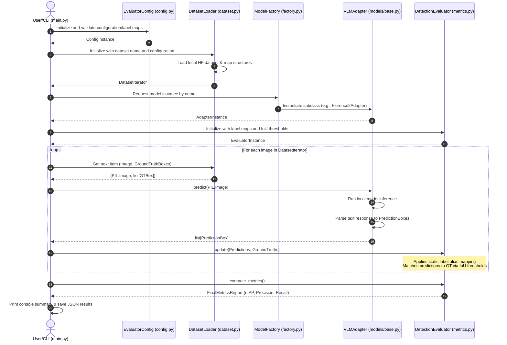

# Technical Architecture: VLM Object Detection Evaluator Backend

This document details the system architecture, component topologies, data lineages, and file specifications for the Vision-Language Model (VLM) object detection evaluation backend.

---

## 1. System Topology & Data Flow Diagrams

### Macro-Architecture & Orchestration
This sequence diagram shows how the entry point orchestration coordinates loading configuration, fetching local Hugging Face datasets, running single-image inference via the VLM Adapter, mapping predicted labels, and updating the detection evaluator to compute final metrics.



### Data Lineage Matrix
The table below traces where the data state is loaded, mutated, and resolved across the lifetime of an evaluation run.

| Data Entity | Loaded From | Mutated By | Cached / Temporary State | Persisted To |
| :--- | :--- | :--- | :--- | :--- |
| **Configuration** | Command line args / config file | Config parser | In-memory `EvaluatorConfig` dataclass | None (Ephemeral) |
| **Ground Truth Annotations** | Local HF Dataset caching layer | Loader (normalized to `[ymin, xmin, ymax, xmax]`) | Loaded per image step | None |
| **Model Predictions** | Local VLM Inference Output | Adapter (parsed text to bounding boxes) | Ephemeral model response structure | None |
| **Aligned Labels** | In-memory configuration dict | Evaluator (aliases mapped during matching) | In-memory mapped predictions | None |
| **Evaluation Metrics** | Evaluator State Accumulator | Evaluator (updates True/False Positives per step) | Cumulative count of detections & IoU matches | JSON report file |

---

## 2. Complete File-by-File Technical Directory Spec

```
/home/ub/vlm_studio/
├── requirements.txt
├── main.py
├── evaluator/
│   ├── __init__.py
│   ├── config.py
│   ├── dataset.py
│   ├── metrics.py
│   └── models/
│       ├── __init__.py
│       ├── base.py
│       ├── florence2.py
│       ├── paligemma.py
│       └── factory.py
└── tests/
    ├── __init__.py
    ├── test_metrics.py
    └── test_adapters.py
```

### File Specification Blocks

#### 1. `requirements.txt`
*   **File Path:** [requirements.txt](file:///home/ub/vlm_studio/requirements.txt)
*   **Core Mandate:** Specifies external dependencies and package versions for local VLM execution, metrics computation, and dataset handling.
*   **Inbound Dependencies:** None
*   **Outbound Dependencies:** Loaded by python runtime / pip installer.
*   **Required Packages:**
    *   `torch` (local hardware acceleration)
    *   `transformers` (VLM interfaces)
    *   `datasets` (Hugging Face dataset interface)
    *   `pillow` (image manipulation)
    *   `tqdm` (CLI progress tracking)
    *   `pytest` (verification suite)
    *   `numpy` (numerical metrics calculations)

#### 2. `main.py`
*   **File Path:** [main.py](file:///home/ub/vlm_studio/main.py)
*   **Core Mandate:** Executable script orchestrating the VLM evaluation lifecycle.
*   **Primary Interfaces:**
    ```python
    def parse_arguments() -> Any: ...
    def main() -> None: ...
    ```
*   **Inbound Dependencies:** None (Entry Point).
*   **Outbound Dependencies:**
    *   [evaluator.config](file:///home/ub/vlm_studio/evaluator/config.py)
    *   [evaluator.dataset](file:///home/ub/vlm_studio/evaluator/dataset.py)
    *   [evaluator.metrics](file:///home/ub/vlm_studio/evaluator/metrics.py)
    *   [evaluator.models.factory](file:///home/ub/vlm_studio/evaluator/models/factory.py)

#### 3. `evaluator/__init__.py`
*   **File Path:** [evaluator/__init__.py](file:///home/ub/vlm_studio/evaluator/__init__.py)
*   **Core Mandate:** Packages the evaluator namespace, exposing top-level classes.
*   **Primary Exports:**
    ```python
    from evaluator.config import EvaluatorConfig
    from evaluator.dataset import DatasetLoader
    from evaluator.metrics import DetectionEvaluator
    ```
*   **Inbound Dependencies:**
    *   [main.py](file:///home/ub/vlm_studio/main.py)
*   **Outbound Dependencies:**
    *   [evaluator.config](file:///home/ub/vlm_studio/evaluator/config.py)
    *   [evaluator.dataset](file:///home/ub/vlm_studio/evaluator/dataset.py)
    *   [evaluator.metrics](file:///home/ub/vlm_studio/evaluator/metrics.py)

#### 4. `evaluator/config.py`
*   **File Path:** [evaluator/config.py](file:///home/ub/vlm_studio/evaluator/config.py)
*   **Core Mandate:** Configuration parameters, validation routines, and label dictionary maps.
*   **Primary Exports:**
    ```python
    from typing import Dict, List
    from dataclasses import dataclass

    @dataclass(frozen=True)
    class EvaluatorConfig:
        model_name: str
        dataset_path: str
        dataset_split: str
        label_map: Dict[str, str]
        iou_thresholds: List[float]
        output_report_path: str
        device: str

        def validate(self) -> bool: ...
    ```
*   **Inbound Dependencies:**
    *   [main.py](file:///home/ub/vlm_studio/main.py)
    *   [evaluator/__init__.py](file:///home/ub/vlm_studio/evaluator/__init__.py)
*   **Outbound Dependencies:** None

#### 5. `evaluator/dataset.py`
*   **File Path:** [evaluator/dataset.py](file:///home/ub/vlm_studio/evaluator/dataset.py)
*   **Core Mandate:** Stream or load local Hugging Face datasets and normalize bounding boxes into target format.
*   **Primary Exports:**
    ```python
    from typing import Iterator, Tuple, List, Dict, Any
    from PIL import Image

    class DatasetLoader:
        def __init__(self, dataset_path: str, split: str) -> None: ...
        def __len__(self) -> int: ...
        def __iter__(self) -> Iterator[Tuple[Image.Image, List[Dict[str, Any]]]]: ...
    ```
    *Note: Bounding Box representation in returned List[Dict[str, Any]] conforms to:*
    `{"bbox": [ymin, xmin, ymax, xmax], "label": str}` (Normalized to range `[0.0, 1.0]`).
*   **Inbound Dependencies:**
    *   [main.py](file:///home/ub/vlm_studio/main.py)
    *   [evaluator/__init__.py](file:///home/ub/vlm_studio/evaluator/__init__.py)
*   **Outbound Dependencies:** None

#### 6. `evaluator/metrics.py`
*   **File Path:** [evaluator/metrics.py](file:///home/ub/vlm_studio/evaluator/metrics.py)
*   **Core Mandate:** Aggregates predictions and ground truths, applies static label mapping, and computes precision, recall, and Average Precision metrics.
*   **Primary Exports:**
    ```python
    from typing import Dict, List, Any

    class DetectionEvaluator:
        def __init__(self, label_map: Dict[str, str], iou_thresholds: List[float]) -> None: ...
        def update(self, predictions: List[Dict[str, Any]], ground_truths: List[Dict[str, Any]]) -> None: ...
        def compute_metrics(self) -> Dict[str, Any]: ...
    ```
    *Input specs for dictionary lists:*
    `predictions: [{"bbox": [ymin, xmin, ymax, xmax], "label": str, "score": float}]`
    `ground_truths: [{"bbox": [ymin, xmin, ymax, xmax], "label": str}]`
*   **Inbound Dependencies:**
    *   [main.py](file:///home/ub/vlm_studio/main.py)
    *   [evaluator/__init__.py](file:///home/ub/vlm_studio/evaluator/__init__.py)
    *   [tests/test_metrics.py](file:///home/ub/vlm_studio/tests/test_metrics.py)
*   **Outbound Dependencies:** None

#### 7. `evaluator/models/__init__.py`
*   **File Path:** [evaluator/models/__init__.py](file:///home/ub/vlm_studio/evaluator/models/__init__.py)
*   **Core Mandate:** Namespace file for VLM adapter modules.
*   **Primary Exports:**
    ```python
    from evaluator.models.base import BaseVLMAdapter
    from evaluator.models.factory import get_model_adapter
    ```
*   **Inbound Dependencies:**
    *   [main.py](file:///home/ub/vlm_studio/main.py)
*   **Outbound Dependencies:**
    *   [evaluator.models.base](file:///home/ub/vlm_studio/evaluator/models/base.py)
    *   [evaluator.models.factory](file:///home/ub/vlm_studio/evaluator/models/factory.py)

#### 8. `evaluator/models/base.py`
*   **File Path:** [evaluator/models/base.py](file:///home/ub/vlm_studio/evaluator/models/base.py)
*   **Core Mandate:** Interface specification for all model adapters. Defines the boundary for model loading and output standardization.
*   **Primary Exports:**
    ```python
    from abc import ABC, abstractmethod
    from typing import Dict, List, Any
    from PIL import Image

    class BaseVLMAdapter(ABC):
        def __init__(self, model_name: str, device: str) -> None: ...
        
        @abstractmethod
        def predict(self, image: Image.Image) -> List[Dict[str, Any]]:
            """Runs local inference and parses output.
            Returns list of dicts: [{'bbox': [ymin, xmin, ymax, xmax], 'label': str, 'score': float}]
            Bboxes must be normalized [0.0, 1.0].
            """
            pass
    ```
*   **Inbound Dependencies:**
    *   [evaluator/models/__init__.py](file:///home/ub/vlm_studio/evaluator/models/__init__.py)
    *   [evaluator/models/florence2.py](file:///home/ub/vlm_studio/evaluator/models/florence2.py)
    *   [evaluator/models/paligemma.py](file:///home/ub/vlm_studio/evaluator/models/paligemma.py)
    *   [evaluator/models/factory](file:///home/ub/vlm_studio/evaluator/models/factory.py)
*   **Outbound Dependencies:** None

#### 9. `evaluator/models/florence2.py`
*   **File Path:** [evaluator/models/florence2.py](file:///home/ub/vlm_studio/evaluator/models/florence2.py)
*   **Core Mandate:** Adapter module specialized for running and parsing local Microsoft Florence-2 models.
*   **Primary Exports:**
    ```python
    from evaluator.models.base import BaseVLMAdapter
    from PIL import Image
    from typing import List, Dict, Any

    class Florence2Adapter(BaseVLMAdapter):
        def predict(self, image: Image.Image) -> List[Dict[str, Any]]: ...
    ```
*   **Inbound Dependencies:**
    *   [evaluator/models/factory.py](file:///home/ub/vlm_studio/evaluator/models/factory.py)
*   **Outbound Dependencies:**
    *   [evaluator.models.base](file:///home/ub/vlm_studio/evaluator/models/base.py)

#### 10. `evaluator/models/paligemma.py`
*   **File Path:** [evaluator/models/paligemma.py](file:///home/ub/vlm_studio/evaluator/models/paligemma.py)
*   **Core Mandate:** Adapter module specialized for running and parsing local Google PaliGemma models.
*   **Primary Exports:**
    ```python
    from evaluator.models.base import BaseVLMAdapter
    from PIL import Image
    from typing import List, Dict, Any

    class PaliGemmaAdapter(BaseVLMAdapter):
        def predict(self, image: Image.Image) -> List[Dict[str, Any]]: ...
    ```
*   **Inbound Dependencies:**
    *   [evaluator/models/factory.py](file:///home/ub/vlm_studio/evaluator/models/factory.py)
*   **Outbound Dependencies:**
    *   [evaluator.models.base](file:///home/ub/vlm_studio/evaluator/models/base.py)

#### 11. `evaluator/models/factory.py`
*   **File Path:** [evaluator/models/factory.py](file:///home/ub/vlm_studio/evaluator/models/factory.py)
*   **Core Mandate:** Factory to resolve and construct the correct VLM adapter based on configuration parameters.
*   **Primary Exports:**
    ```python
    from evaluator.models.base import BaseVLMAdapter

    def get_model_adapter(model_name: str, device: str) -> BaseVLMAdapter: ...
    ```
*   **Inbound Dependencies:**
    *   [main.py](file:///home/ub/vlm_studio/main.py)
    *   [evaluator/models/__init__.py](file:///home/ub/vlm_studio/evaluator/models/__init__.py)
*   **Outbound Dependencies:**
    *   [evaluator.models.base](file:///home/ub/vlm_studio/evaluator/models/base.py)
    *   [evaluator.models.florence2](file:///home/ub/vlm_studio/evaluator/models/florence2.py)
    *   [evaluator.models.paligemma](file:///home/ub/vlm_studio/evaluator/models/paligemma.py)

#### 12. `tests/__init__.py`
*   **File Path:** [tests/__init__.py](file:///home/ub/vlm_studio/tests/__init__.py)
*   **Core Mandate:** Package initialization for test discovery.
*   **Inbound Dependencies:** None
*   **Outbound Dependencies:** None

#### 13. `tests/test_metrics.py`
*   **File Path:** [tests/test_metrics.py](file:///home/ub/vlm_studio/tests/test_metrics.py)
*   **Core Mandate:** Unit tests for verification of calculation metrics (IoU, precision, recall, AP) and label mapping functionality.
*   **Primary Interfaces:**
    ```python
    def test_iou_computation() -> None: ...
    def test_label_mapping_alignment() -> None: ...
    def test_ap_calculation() -> None: ...
    ```
*   **Inbound Dependencies:** None
*   **Outbound Dependencies:**
    *   [evaluator.metrics](file:///home/ub/vlm_studio/evaluator/metrics.py)

#### 14. `tests/test_adapters.py`
*   **File Path:** [tests/test_adapters.py](file:///home/ub/vlm_studio/tests/test_adapters.py)
*   **Core Mandate:** Mock testing to verify that adapter parser interfaces transform sample text output from local models into correct bounding box formats.
*   **Primary Interfaces:**
    ```python
    def test_florence_parser() -> None: ...
    def test_paligemma_parser() -> None: ...
    ```
*   **Inbound Dependencies:** None
*   **Outbound Dependencies:**
    *   [evaluator.models.florence2](file:///home/ub/vlm_studio/evaluator/models/florence2.py)
    *   [evaluator.models.paligemma](file:///home/ub/vlm_studio/evaluator/models/paligemma.py)

---

## 3. State Management & Runtime Isolation

### Threading & Async Execution
*   The execution loop runs **synchronously and sequentially**. Because model inference is highly resource-intensive on GPUs, executing async concurrency on the same process/device risks CUDA Out-Of-Memory (OOM) errors and runtime crashes.
*   State mutations are confined strictly within the evaluation process instance:
    *   No shared memory pools across worker threads.
    *   No multiprocessing locks or synchronization blocks required.

### Resource Boundaries & Device Allocation
*   **VRAM Safeguards:** Local VLMs require device VRAM (CUDA, ROCm, or MPS). The adapter initializes models with device mapping parameters (e.g., `.to(device)` or `device_map="auto"`).
*   **Model Cleanup:** When changing models or terminating run, the Python process must exit to guarantee CUDA memory releases, or explicitly run:
    ```python
    import gc
    import torch
    # For execution within model transitions:
    del model
    gc.collect()
    torch.cuda.empty_cache()
    ```
*   **File Storage Limits:** The dataset loader will rely on local caching parameters from the Hugging Face `datasets` library. Users can customize `HF_HOME` to control disk limits.

### Failure Boundaries & Recovery
*   **Malformed Model Outputs:** If a model returns an unparseable response, the parser adapter must catch exceptions, log a warning, register an empty prediction set `[]` for that step, and continue execution. It **must not** crash the run.
*   **Missing Labels:** If ground truth annotations contain a label that is not configured in the metrics dictionary mapping and not matching anything, it will be processed normally as a standard label string, minimizing failures due to label mismatches.
*   **Out-of-Memory (OOM):** If a local model triggers a CUDA OOM error, the backend process terminates. Since execution runs single-image evaluation iteratively and appends logs, we can resume runs from a checkpoint/index if needed. For the initial version, the index state will be written out line-by-line to a telemetry log to trace where it aborted.

---

## 4. Codebase Bootstrap Strategy

To build and wire the system safely, follow this sequence:

1.  **Anchor Layer (Core Contracts & Setup)**
    *   Generate [requirements.txt](file:///home/ub/vlm_studio/requirements.txt) and initialize environment.
    *   Create base config schemas: [evaluator.config](file:///home/ub/vlm_studio/evaluator/config.py).
    *   Write the abstract base adapter class: [evaluator.models.base](file:///home/ub/vlm_studio/evaluator/models/base.py).
2.  **Dataset & Logic Layer**
    *   Implement [evaluator.dataset](file:///home/ub/vlm_studio/evaluator/dataset.py) to parse local datasets into images and bounding box coordinate representations.
    *   Write [evaluator.metrics](file:///home/ub/vlm_studio/evaluator/metrics.py) containing mathematical functions (IoU, mAP, and mapping logic).
3.  **Adapter Implementations**
    *   Build parser logic & model initialization for [evaluator.models.florence2](file:///home/ub/vlm_studio/evaluator/models/florence2.py).
    *   Build parser logic & model initialization for [evaluator.models.paligemma](file:///home/ub/vlm_studio/evaluator/models/paligemma.py).
    *   Implement the resolver factory: [evaluator.models.factory](file:///home/ub/vlm_studio/evaluator/models/factory.py).
4.  **Orchestrator & Testing**
    *   Implement unit tests in [tests/test_metrics.py](file:///home/ub/vlm_studio/tests/test_metrics.py) and [tests/test_adapters.py](file:///home/ub/vlm_studio/tests/test_adapters.py) using mocked inputs to verify core logic without loading local GPUs.
    *   Build [main.py](file:///home/ub/vlm_studio/main.py) to bind everything together and output CLI/JSON summaries.
